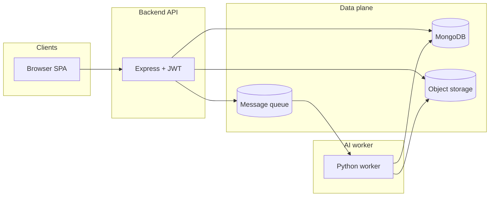

# Scriptify (Media-To-Text)

**Scriptify** is a web application that turns uploaded **audio and video** into **time-aligned transcripts**. Users choose a **target language** for the final text; the system uses **speech recognition** (OpenAI Whisper) and, when needed, **machine translation** (Google Gemini) to produce subtitles-style segments and plain text. The product is built as a **monorepo** with a React frontend, a Node.js API, asynchronous background processing, object storage for files, and MongoDB for metadata.

---

## 1. What the system does

1. **Authenticate** users and distinguish **regular users**, **workers** (internal), and **admins**.
2. Let users **upload** media via a **presigned URL** flow (direct upload to object storage).
3. **Finalize** the upload in the API, persist a **Media** record, and enqueue a **job** for the worker.
4. A **Python worker** pulls jobs from a **message queue**, downloads the file, extracts audio, runs **Whisper**, optionally **translates** via Gemini, writes a **JSON transcript** to object storage, and updates **MongoDB**.
5. Users **view** progress, **play** media with a presigned stream URL, **edit** transcript text and segments in the UI, **download** SubRip (`.srt`), and **soft-delete** media (files removed from storage; DB rows kept for audit).
6. **Admins** inspect aggregate stats, browse all media and users, monitor failed/processing jobs, and **restore** soft-deleted media records.

---

## 2. Repository layout

| Path | Role |
|------|------|
| `apps/frontend` | React (Vite) SPA: auth, dashboard, upload, media detail, transcript editor, admin UI. |
| `apps/backend` | Express REST API: auth, media, transcripts, admin; integrates MongoDB, queue, S3-compatible storage. |
| `apps/ai_worker` | Python consumer: RabbitMQ → MinIO → FFmpeg → Whisper → optional Gemini → MinIO + MongoDB. |
| `apps/shared` | Shared static data, e.g. `languages.json` (allowed target languages), imported by frontend and backend. |

---

## 3. Logical architecture (conceptual)

- **Browser** talks only to the **API** (and to **object storage** using short-lived URLs returned by the API).
- The **worker** is decoupled: it reads the same **MongoDB** and **object storage** and consumes **queue** messages; it does not receive HTTP requests from end users.

---

## 4. End-to-end media pipeline

### 4.1 Upload (two-step pattern)

1. **Presigned upload URL**  
   The client requests a URL from the API. The API generates a **PUT**-style presigned URL and a deterministic **`fileKey`** (path in the bucket, typically `media/{userId}/{uuid}_{originalFileName}`).

2. **Direct upload**  
   The browser uploads the file **directly to object storage** using that URL. This keeps large binaries off the API server.

3. **Finalize**  
   The client calls **finalize** with metadata: filename, `fileKey`, media type (AUDIO / VIDEO), file format, **target language code**, and optional **source language code**.  
   The API:
   - Validates the target language against **`apps/shared/languages.json`**.
   - Sets **source language mode**: `FORCED` if a source code was sent, otherwise `AUTO`.
   - Creates a **Media** document with status `UPLOADED` and storage reference (bucket + key).
   - Publishes a **JSON message** to the queue: `mediaId`, `userId`, `fileKey`, `targetLanguageCode`, `sourceLanguageCode`.

### 4.2 Processing (worker)

For each message, the worker:

1. Sets **Media** status to `PROCESSING` (and clears or adjusts `errorDetails` depending on retry state).
2. **Downloads** the object from storage to a temp file (extension validated against a configurable allow-list).
3. Rejects **empty** files.
4. Measures **duration** with **ffprobe**.
5. **Extracts audio** with **FFmpeg** to a mono, 16 kHz WAV suitable for Whisper.
6. Runs **Whisper** (`small` model in the current codebase; device is CUDA when available, else CPU) with **`fp16=False`** for stability.
7. Applies **language / translation rules** (see §7).
8. Builds a JSON document `{ text, segments }` and uploads it to storage under `transcripts/{mediaId}_{outputLang}.json`.
9. Inserts a **Transcript** document in MongoDB (plain text, language, confidence, timings, pointer to JSON in storage).
10. Updates **Media** to `COMPLETED` with size, detected language, and length.

On failure, the worker records **`errorDetails`** (stage, technical message, user-facing message, attempt) and may **requeue** once so a second attempt runs (implementation uses RabbitMQ **nack** with `requeue` on first failure).

---

## 5. Media lifecycle and statuses

| Status | Meaning |
|--------|---------|
| `UPLOADING` | Initial schema default; in practice the record is often created at `UPLOADED` after finalize. |
| `UPLOADED` | Object is in storage; job not yet consumed or worker not started. |
| `PROCESSING` | Worker owns the job. |
| `COMPLETED` | Transcript row exists; JSON in storage. |
| `FAILED` | Worker failed; `errorDetails` explains stage and retry state. |

**Soft delete:** User delete does **not** remove MongoDB documents. It sets **`deletedAt`**, deletes the main media object and transcript JSON from storage (best effort), and keeps **Media** and **Transcript** documents for admin/audit. List endpoints for normal users exclude soft-deleted items.

---

## 6. Authentication and authorization

### 6.1 Registration and login

- Passwords are stored **hashed** (bcrypt).
- Successful register/login returns a **JWT** (JSON Web Token), typically valid for several days.
- Clients send `Authorization: Bearer <token>` on protected routes.

### 6.2 JWT payload

The token embeds **`user.id`** and **`role`**. Middleware loads this into `req.user` for downstream handlers.

### 6.3 Role assignment at registration

Role is derived from **email pattern** (in addition to whatever is stored on the user document):

- Addresses ending in **`.admin@scriptify.com`** or exactly **`admin@scriptify.com`** → **`admin`**
- Addresses ending in **`@scriptify.com`** → **`worker`**
- All others → **`user`**

On login, the stored **DB role** is preferred; the email pattern is a fallback for legacy users.

### 6.4 Route protection

- **`auth`**: requires valid JWT.
- **`adminAuth`**: requires JWT **and** `role === 'admin'`.

Admin API routes apply **both** middlewares globally on the router.

---

## 7. Transcription and translation logic (worker)

This is the core business logic for turning audio into the final language.

### 7.1 Whisper **task**

- If **target language** is **`en`**, Whisper runs with **`task="translate"`** (Whisper outputs English).
- Otherwise Whisper runs with **`task="transcribe"`** (output in detected or forced source language).

### 7.2 Source language

- If the client sends a **source language code** (not `auto`), Whisper is called with **`language=`** fixed to that code.
- If not, Whisper **auto-detects** the language.

**Effective source** for later steps = forced source if set, else Whisper’s **`detected_lang`**.

### 7.3 Normalizing target

The **target** from the job is compared to the effective source (and to Whisper’s detected language) in a case-normalized way.

### 7.4 Branching after Whisper

1. **`targetLanguageCode === 'original'`**  
   Output is Whisper’s result as-is; output language metadata = **detected** language.

2. **`targetLanguageCode === 'en'`**  
   Whisper already ran **`translate`**; output text/segments are used directly; output language = **`en`**.

3. **Target equals source** (same as effective source or same as detected)  
   No extra translation: use Whisper output; output language = chosen target code.

4. **Any other target** (e.g. Hindi when source was Chinese)  
   **Pivot through English** with **Gemini** (two API calls):
   - First: translate transcript JSON (**text + segments**) **to English**, preserving segment boundaries and timing rules per prompt.
   - Second: translate that English JSON **to the final target language**, again preserving structure.

Gemini is instructed to **only translate `text` fields**, keep **`start` / `end`** aligned with originals (with server-side validation that restores timing from the original segments if needed), and to **not translate proper names** inappropriately.

If **`GEMINI_API_KEY`** is missing, the pivot path cannot run as designed (translation-dependent targets would fail or require alternate handling).

### 7.5 Confidence score

After Whisper, **confidence** (0–1) is derived from segment **`avg_logprob`** values: average log-probability, then **`exp`** and rounding. Stored on the **Transcript** document.

---

## 8. Object storage and the S3 API

The backend uses the **AWS SDK for JavaScript v3** (`S3Client`) with **path-style** addressing and a configurable **`STORAGE_ENDPOINT`**, so the same code works with **MinIO** or AWS S3.

**Presigned URLs** (upload and playback) are generated with that same client configuration. Whatever **host and port** are embedded in the signed URL must be **reachable from the user’s browser**; otherwise direct uploads or inline playback will fail. In split-network deployments (e.g. API in a container network vs browser on the host), this is usually solved by choosing an endpoint hostname that resolves correctly for **both** the API process and the browser, or by extending the backend with a second S3 client used only for signing (not present in the minimal tree).

The **Python worker** uses the **MinIO** client with **`STORAGE_ENDPOINT`**, **`STORAGE_ACCESS_KEY`**, and **`STORAGE_SECRET_KEY`**. The MinIO library expects an endpoint in **`host:port`** form (no `http://` prefix); deployment configuration should match what each library accepts.

---

## 9. Message queue contract

The backend sends a **persistent** JSON message to a named **durable** queue. Payload fields used by the worker include:

- **`mediaId`** – MongoDB ObjectId string  
- **`userId`** – uploader (for traceability; worker primarily keys off `mediaId`)  
- **`fileKey`** – object key in the bucket  
- **`targetLanguageCode`** – e.g. `en`, `hi`, `original`  
- **`sourceLanguageCode`** – optional; may be `auto` or omitted  

The worker uses **prefetch** and **acknowledgements**: one job at a time, **ack** on success, **nack** with optional requeue on failure.

---

## 10. Transcript data shape and API behavior

### 10.1 Stored JSON (object storage)

The canonical artifact is JSON with:

- **`text`** – full transcript string  
- **`segments`** – array of objects with at least **`start`**, **`end`**, **`text`** (Whisper-style segments; may include extra fields)

### 10.2 MongoDB **Transcript** document

- Links to **Media** via **`mediaId`**
- **`plainText`** – denormalized full text for quick display/search
- **`jsonFile`** – bucket, key, format, size
- **`language`** – output language code
- **`confidence`**, **`modelSize`**, **`modelProcessingTime`**, **`totalTranscriptionTime`**
- Optional **`languageDetectionConfidence`** field exists in the schema for future use

### 10.3 Transcript HTTP API (authenticated user, owns media)

- **GET content** – stream JSON from storage via the API (for the editor UI).
- **PUT update** – update **`plainText`** in MongoDB and **overwrite** the JSON object in storage with new `text` + `segments`.
- **GET download (SRT)** – read JSON from storage, convert segments to **SubRip** timestamps, return as downloadable `.srt`.

SRT time formatting converts segment **start/end** seconds into `HH:MM:SS,mmm` lines.

### 10.4 Access control nuance

**Media** routes generally enforce that the authenticated user **owns** the document (`mediaUploadedBy`). **Transcript** routes look up a transcript by **`mediaId`** with a valid JWT but do not always re-check media ownership in the controller layer; understanding the codebase includes knowing that tightening this (verify `Media.mediaUploadedBy === req.user.id` or admin) is a typical hardening step.

---

## 11. Media HTTP API (user)

Typical operations (all require JWT):

- Request **presigned upload** URL + key  
- **Finalize** upload and enqueue processing  
- **List** own media (excluding soft-deleted; some fields like raw storage may be omitted in list views)  
- **Get** one media item **with** transcript metadata  
- **Delete** (soft delete + storage cleanup)  
- **Playback URL** – presigned **GET** for inline streaming with content disposition derived from filename  

---

## 12. Admin panel (logic)

Admins use the same JWT mechanism with **`admin`** role. Capabilities include:

- **Dashboard stats** – counts of users, media (total / active / deleted / failed / processing), transcripts, aggregate **storage bytes** from `sizeBytes`, and **recent uploads**.
- **Media browser** – filter by status, type, deleted flag, filename search, user id; paginated.
- **Media detail** – full document including soft-deleted; includes transcript metadata when present.
- **Users list** – without passwords; **media counts** per user via aggregation.
- **Jobs view** – recent **FAILED** and **PROCESSING** items for monitoring.
- **Restore** – clear **`deletedAt`** on a media record (does not restore deleted storage objects automatically).

---

## 13. Frontend application structure (logical)

- **Auth context** – holds token and user state; protects routes.
- **Landing / login / register** – onboarding.
- **Dashboard** – lists user media and status.
- **Upload** – chooses file, target language (and optional source), uses presigned flow then finalize.
- **Media detail** – playback, processing timeline, transcript view/edit, download SRT, delete.
- **Admin section** – separate layout and routes; dashboard, media list/detail, users, jobs.

Shared **language lists** come from **`apps/shared/languages.json`** so UI and API stay aligned.

---

## 14. Data models (summary)

| Model | Purpose |
|-------|---------|
| **User** | Identity, hashed password, role (`user` \| `worker` \| `admin`), last login. |
| **Media** | Ownership, filename, type, format, status, storage reference, optional source language fields, detected language, duration, size, `errorDetails`, `deletedAt`. |
| **Transcript** | One primary transcript per media in the main flow; text + storage pointer to JSON + metrics. |
| **Storage** (embedded schema) | Reusable `{ bucket, key, format, sizeBytes? }` for media and transcript files. |
| **Summary** | Schema exists for future **summarization** (linking media, transcript, summary text and language); not wired through the main REST surface in the current tree. |

---

## 15. Error handling philosophy

- **API** returns appropriate HTTP codes and short messages; admin and user views can show **friendly** strings.
- **Worker** classifies failures into **stages** (download, extract, transcribe, translate, upload, DB) and stores both a **technical** `message` and a **userMessage** when possible.
- **Retries** are limited (e.g. one automatic requeue) to avoid infinite loops on bad files.

---

## 16. Technology choices (informational)

- **Frontend:** React, Vite, Tailwind (and related UI tooling).  
- **Backend:** Node.js, Express, Mongoose, JWT, bcrypt, AWS SDK v3 (S3), AMQP client.  
- **Worker:** Python, PyTorch / Whisper, FFmpeg, MinIO client, Pika, PyMongo, Google GenAI client for Gemini.  
- **Data:** MongoDB for documents; S3-compatible storage for blobs; AMQP-compatible queue for jobs.

---

This document describes **what** the project is and **how its parts fit together**. It intentionally omits deployment, environment setup, and run instructions.
